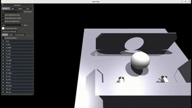
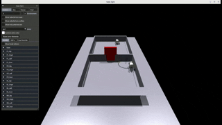

# Multi-agent Quadruped Environment (Extended)

<p align="center">
  <a href="README.md">
    
  </a>
</p>

본 저장소는 [MQE(Multi-agent Quadruped Environment)](https://github.com/ziyanx02/multiagent-quadruped-environment)를 기반으로, 사족 보행 로봇의 다중 에이전트 강화학습 연구를 위한 새로운 협동 과제를 추가한 확장 프로젝트이다.

## 주요 기여

- 원본 MQE에 공 밀기와 버튼-게이트 통과 협동 과제 추가
- 물체 조작, 목표 지점 통과, 버튼 기반 역할 분담을 포함하는 강화학습 시나리오 구성
- 보조 실험을 위한 경량/중간 무게 pushbox 변형 제공
- 각 과제에 대한 config, wrapper, URDF 에셋, 데모 영상 정리
- 원본 MQE의 Isaac Gym 기반 시뮬레이션 및 OpenRL 학습 파이프라인 재사용

## 데모

| go1pushball | go1gatewithbutton |
|:-:|:-:|
| 두 에이전트가 협력하여 공을 벽의 구멍 안으로 밀어 넣는 과제 | 한 에이전트가 버튼을 눌러 게이트를 열고, 다른 에이전트가 그 사이를 통과하는 과제 |
|  |  |
| <a href="https://youtu.be/AEJCpX3f1oI"></a> | <a href="https://youtu.be/ABykIjPuPos"></a> |

---

## 추가 과제

원본 MQE 프레임워크 위에 두 개의 핵심 협동 과제를 추가하고, 기존 pushbox 과제의 난이도 조절 변형을 함께 제공한다.

| 구분 | 과제 이름 | 설명 |
|:-:|:-:|:-:|
| 핵심 과제 | `go1pushball` | 두 에이전트가 공을 함께 밀어 벽의 구멍을 통과시켜야 하는 물체 조작 과제. 단순 전진이 아니라 공의 위치를 중심으로 접근, 접촉, 방향 조정이 함께 요구된다. |
| 핵심 과제 | `go1gatewithbutton` | 버튼을 눌러 게이트를 열고 통과해야 하는 과제. 같은 목표를 위해 위치 분담과 순차적 협력을 유도한다. |
| 보조 변형 | `go1pushbox-light` / `go1pushbox-medium` | 원본 `go1pushbox`의 박스 무게를 낮춘 난이도 조절 변형. 독립적인 신규 시나리오라기보다 협동 밀기 행동을 더 쉽게 실험하기 위한 보조 과제이다. |

각 과제는 설정 파일(`mqe/envs/configs/`), 래퍼(`mqe/envs/wrappers/`), 대응되는 URDF 에셋(`resources/objects/`)을 포함한다.

---

## 평가 결과

아래 결과는 `eval/evaluate.py`로 평가한 유지 대상 결과이다. 모든 평가는 episode 100개, seed `0`, 동일한 episode당 step 제한 조건에서 수행했다.

| 과제 | 알고리즘 | 성공 기준 | 성공률 |
|:-:|:-:|:-|:-:|
| `go1pushball` | PPO | `dist(ball_position, target_position) < 0.2` | 60 / 100 (60%) |
| `go1pushball` | MAT | `dist(ball_position, target_position) < 0.2` | 92 / 100 (92%) |
| `go1gatewithbutton` | PPO | `any(agent_position.x > 4.0)` (4.0: 게이트 통과선) | 9 / 100 (9%) |
| `go1gatewithbutton` | MAT | `any(agent_position.x > 4.0)` (4.0: 게이트 통과선) | 99 / 100 (99%) |

---

## Task Implementation Summary

### `go1pushball`

- Config: `mqe/envs/configs/go1_pushball_config.py`
- Wrapper: `mqe/envs/wrappers/go1_pushball_wrapper.py`
- Asset: `resources/objects/ball_heavy.urdf`
- Setup: agent 2개, NPC ball 1개, `hole_wall` terrain, 15초 episode
- Reward: ball progress toward the hole, per-agent ball approach, ball contact, hole success reward
- Termination: 성공 시 종료하며, 기본적으로 roll/pitch 기반 종료 조건 사용

### `go1gatewithbutton`

- Config: `mqe/envs/configs/go1_gate_with_button_config.py`
- Wrapper: `mqe/envs/wrappers/go1_gate_with_button_wrapper.py`
- Asset: `resources/objects/gate.urdf`
- Setup: agent 2개, fixed NPC gate 1개, button position `[3.0, -1.0]`, button radius `0.5`
- Gate logic: button이 눌리면 gate height를 `2.0`으로 올리고, 눌리지 않으면 `0.5`로 유지
- Reward: button distance improvement, forward progress before `success_x=4.0`, shared button press reward (`0.1`), agent proximity penalty (`distance < 1.5`), gate success reward (`50`)
- Termination: 하나 이상의 agent가 gate 이후 영역에 도달하면 success로 종료
- Note: 특정 agent role을 고정하지 않고, button 접근과 gate 통과를 통해 role separation이 나타나도록 유도한다.

### `go1pushbox-light` / `go1pushbox-medium`

- Config: `mqe/envs/configs/go1_pushbox_light_config.py`, `mqe/envs/configs/go1_pushbox_medium_config.py`
- Wrapper: `mqe/envs/wrappers/go1_pushbox_wrapper.py`
- Asset: `resources/objects/box_light.urdf`, `resources/objects/box_medium.urdf`
- Setup: 원본 `go1pushbox`와 동일한 wrapper를 사용하되, box mass만 조절한 보조 변형
- Mass: light box 1, medium box 3, original box 6
- Reward: box x-axis progress를 두 agent에게 shared reward로 제공

---

## 구현 구조

| 경로 | 역할 |
|:-:|:-|
| `mqe/envs/configs/` | 과제별 환경 설정, 에이전트/NPC 수, 지형, 초기 위치, 보상 scale 정의 |
| `mqe/envs/wrappers/` | 관측 구성, action scaling, 보상 계산, 성공/종료 조건 정의 |
| `mqe/envs/utils.py` | `make_mqe_env`에서 사용하는 task 이름, config, wrapper 매핑 |
| `mqe/envs/__init__.py` | task registry 등록 |
| `resources/objects/` | 공, 박스, 게이트 등 URDF 에셋 |
| `docs/static/videos/` | README 데모용 GIF/WebM |

---

## 실행 방법

설치와 기본 의존성은 원본 MQE 절차를 따른다. Isaac Gym, PyTorch, OpenRL 환경 설정은 [원본 MQE README](https://github.com/ziyanx02/multiagent-quadruped-environment#installation)를 참고한다.

테스트 렌더링은 `test.py`의 `task_name`을 원하는 과제로 바꾼 뒤 실행한다. 현재 기본값은 `go1pushball`이다.

```bash
python ./test.py
```

OpenRL 학습 예시는 다음과 같다.

```bash
python ./openrl_ws/train.py --algo ppo --task go1pushball --num_envs 16 --train_timesteps 100000 --headless
```

다른 추가 과제는 `--task`에 다음 값을 지정하여 실행한다.

```text
go1pushball
go1gatewithbutton
go1pushbox-light
go1pushbox-medium
```

`go1pushbox-light`, `go1pushbox-medium`은 `mqe/envs/utils.py`에서 사용하는 실행용 task 이름이다. config 내부 `env_name`과 일부 task registry에는 underscore 형식(`go1pushbox_light`, `go1pushbox_medium`)도 등록되어 있다.

학습된 policy 평가는 checkpoint 경로를 지정해 실행한다.

```bash
python ./openrl_ws/test.py --algo ppo --task go1pushball --checkpoint /PATH/TO/CHECKPOINT
```

성공률 표 재현 평가는 `python ./eval/evaluate.py --algo ALGO_NAME --task TASK_NAME --checkpoint /PATH/TO/CHECKPOINT --episodes 100 --seed 0 --headless`로 실행한다.

---

## 원본 MQE 안내

본 프로젝트는 원본 MQE 저장소를 기반으로 확장되었다. 원본 MQE는 Isaac Gym 기반의 다중 사족 보행 로봇 시뮬레이션 환경이다. 설치 방법, 코드 구조, 사용법, 기존 협동/경쟁 과제, 문제 해결, 인용 정보는 원본 문서를 참고한다.

- 원본 저장소: https://github.com/ziyanx02/multiagent-quadruped-environment
- 프로젝트 웹사이트: https://ziyanx02.github.io/multiagent-quadruped-environment/
- 논문: https://arxiv.org/abs/2403.16015
- 이 저장소의 영어 README: [README.md](README.md)
